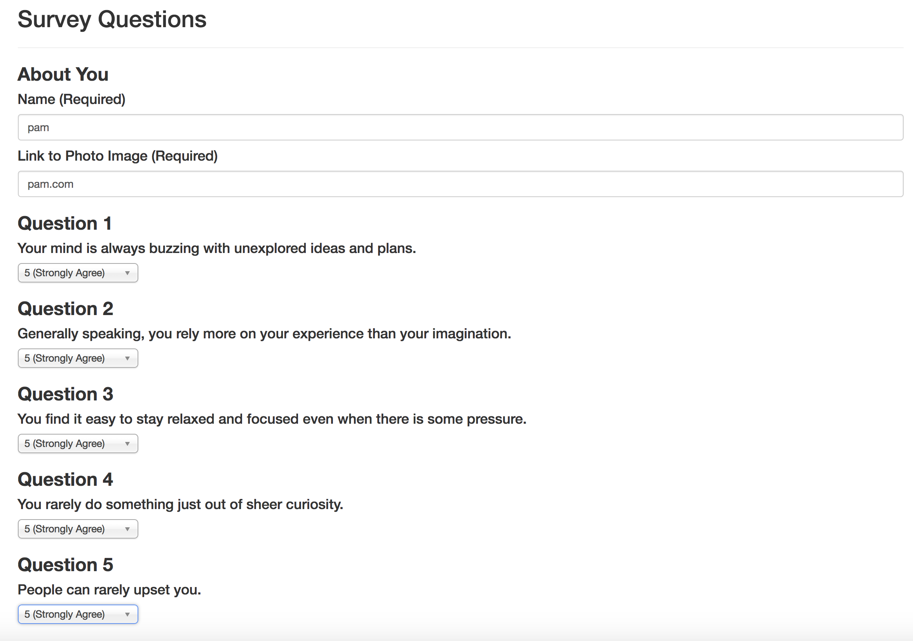
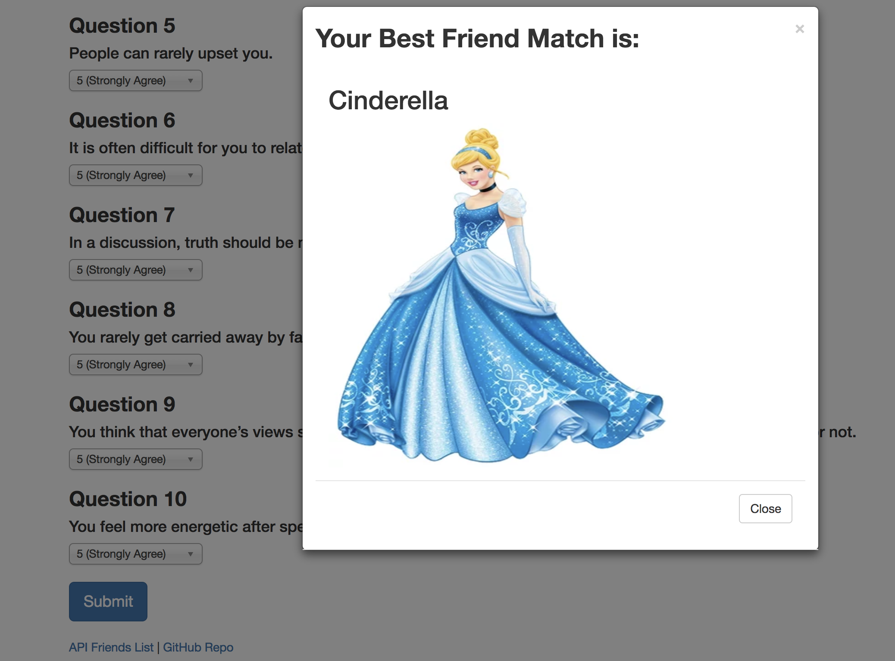
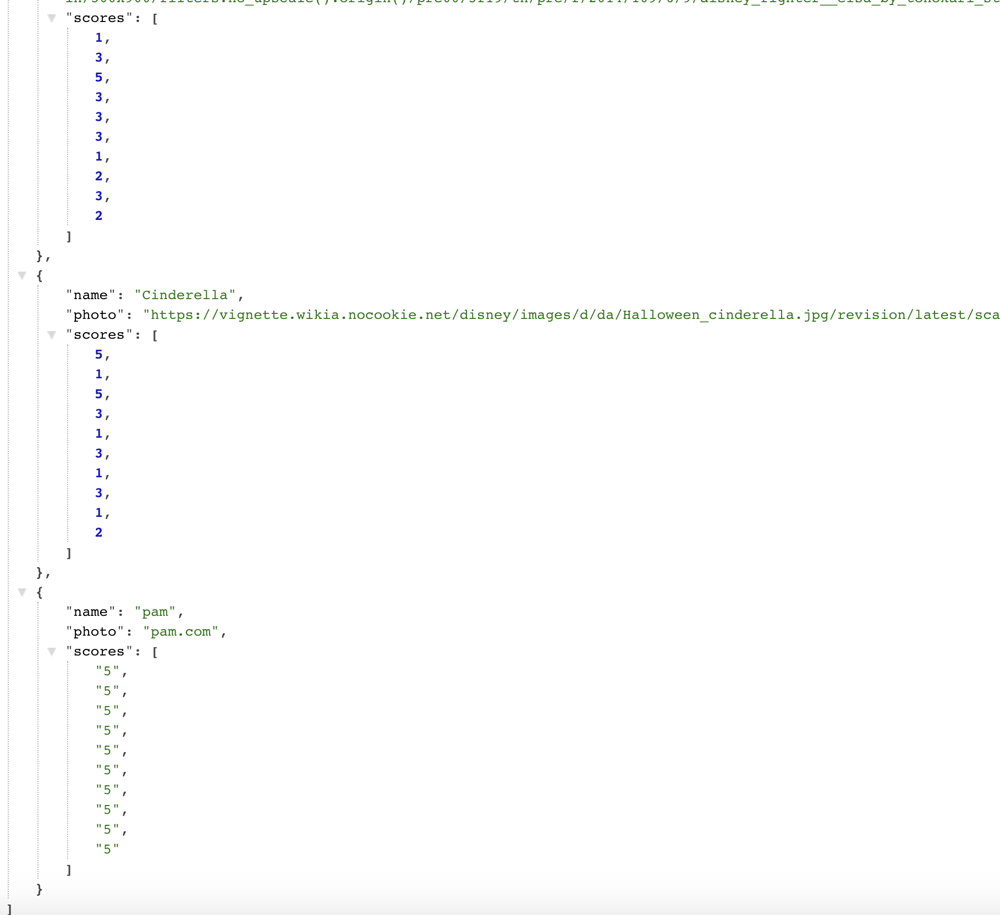

# FriendFinder

This a node based friend finder app.

When you first visit the application, you see the home Page.
In a homepage, there is a button "begin survey". When you click on begin survey it takes you to the survey landing page.

In a survey page, there are ten questions that you need to fillup begining with your name and imagelink. Each answer is given in a scale from 1 to 5 based on how much the user agrees or disagrees with question.

Once you filled out the survey and hit submit button, your bestmatch will be displayed as a modal pop-up with the name and picture. Also your data is added to the system and can be searched untill the connection to the server is ended.

